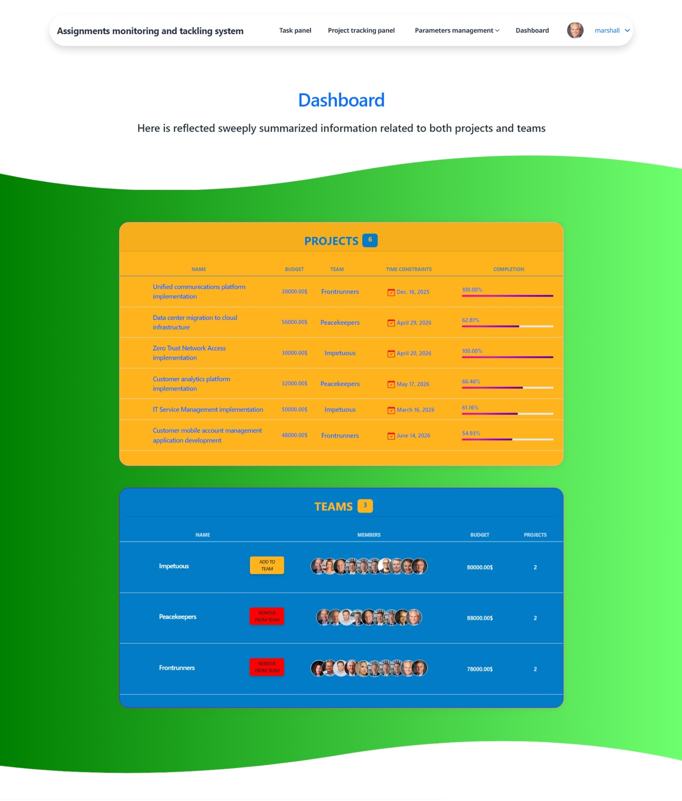

# Assignments monitoring and tackling system

There is my personally developed website to assist you and your team in streamlining work management!

This venue places at your disposal efficient means for regimented maintaining of both standalone simple 
assignments (tasks) and compound multifaceted assignments (projects). You are able to resolve tasks individually 
using Task panel. You might as well collaborate along with other workers to tackle projects by leveraging Dashboard 
and Project tracking panel. Tags help you to simplify the navigation through finding similar assignments faster.

### Check it out!
[Workflow Organizer project deployed to Render](https://workflow-organizer.onrender.com/)

### Try
```shell
login: marshall
password: 1qazcde3
```

## Installation

### General provisions

Python3 must be already installed

```shell
git clone https://github.com/callogan/workflow_organizer.git
cd workflow_organizer
python3 -m venv venv
venv\Scripts\activate
pip install -r requirements.txt
```

### Environment variables

Before you can run the project, you need to create a .env file in the project root directory. 
This file will contain environment variables that are required for the project to run.

.env.sample is provided as a starting point. You will need to replace the values in this file with your own ones.

### Running the project

Once you have created the .env file, you can launch the project by running the following command:

```shell
python manage.py runserver
```

## Features

* Functionality related to user authentication
* Ability to create teams and projects
* Maintaining your Task panel and Project tracking panel
* Sorting tasks by tags

## Demo




